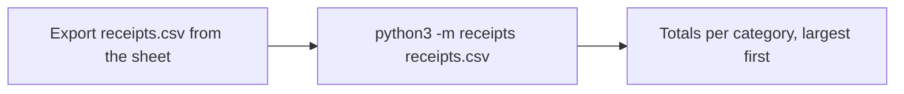

# Design

Designer: Atilade (@atiladeokegab). Owned by the designer: to change anything here, open a
change-request (AGENTS.md §7) addressed to them. Each vertical's `Design:` line says which
sections of this page it must follow.

## Flow

## Screens and commands

| Screen or command | Shows | The user can |
|---|---|---|
| `python3 -m receipts FILE` | one line per category, then a total line | rerun on a fixed file |

## States

| Where | Empty | Loading | Error |
|---|---|---|---|
| `python3 -m receipts` | "No receipts in march.csv." | nothing (it is instant) | a skipped row: "line 7: bad amount 'twelve', skipped" on stderr, then carry on |

## Copy

| Where | Words |
|---|---|
| a skipped row (stderr) | "line 7: bad amount 'twelve', skipped" |
| the total line | "Total  £123.45" |
